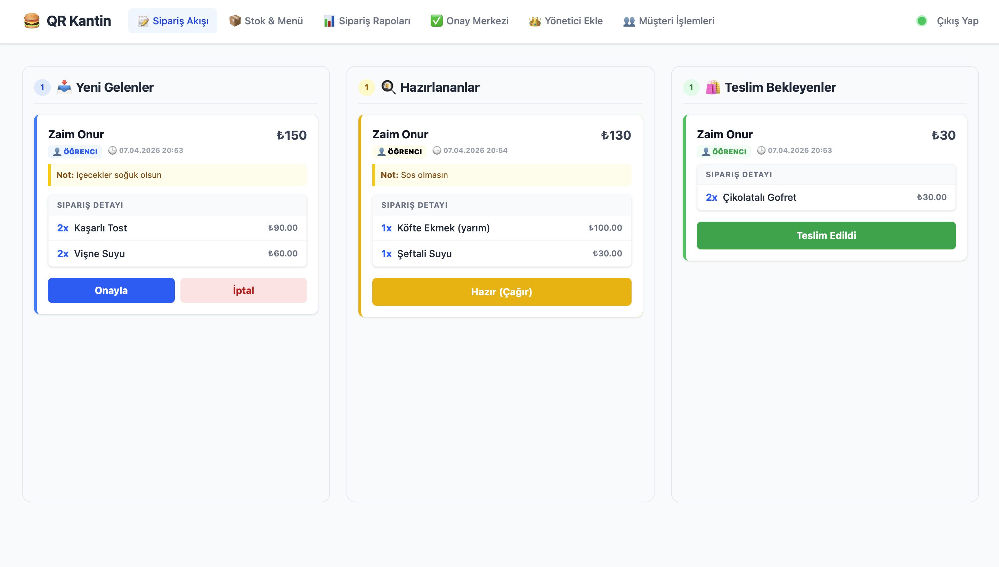
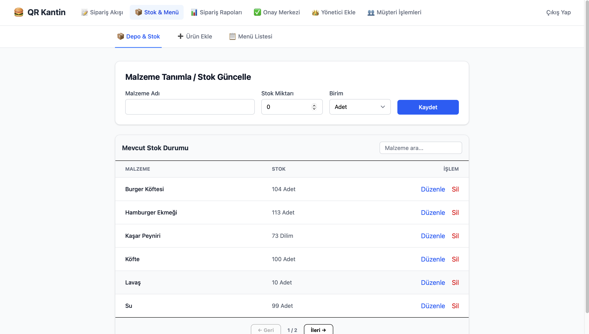
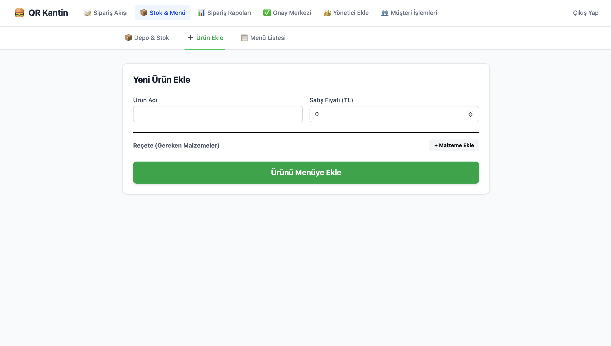
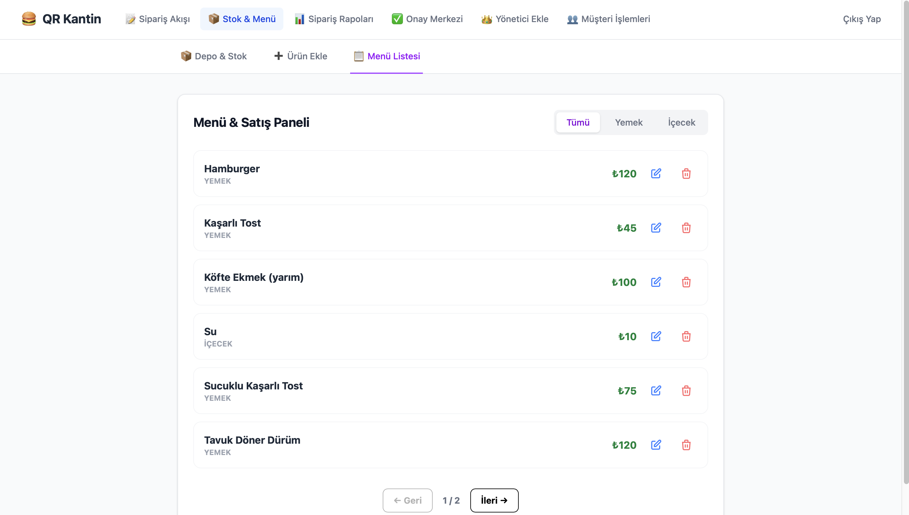
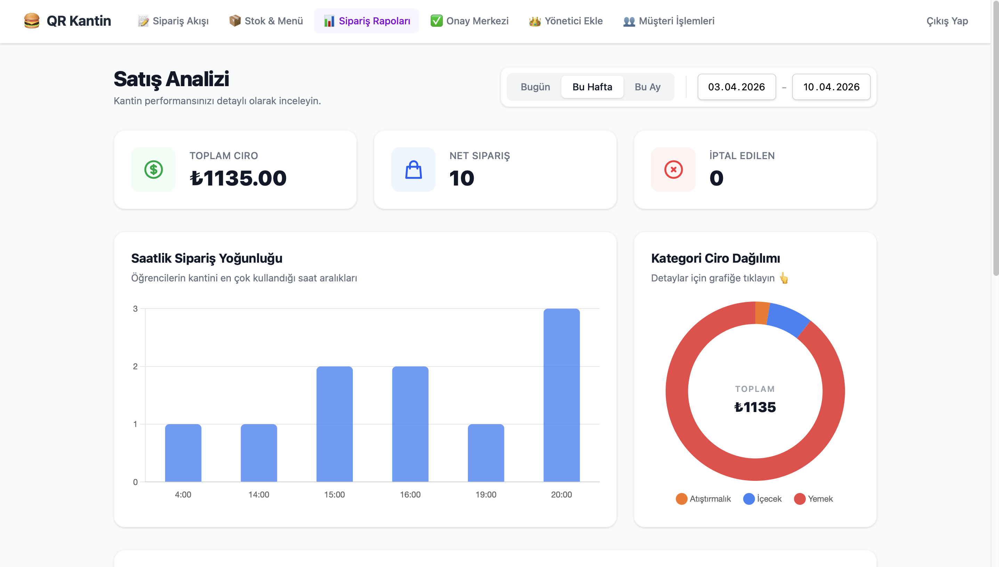
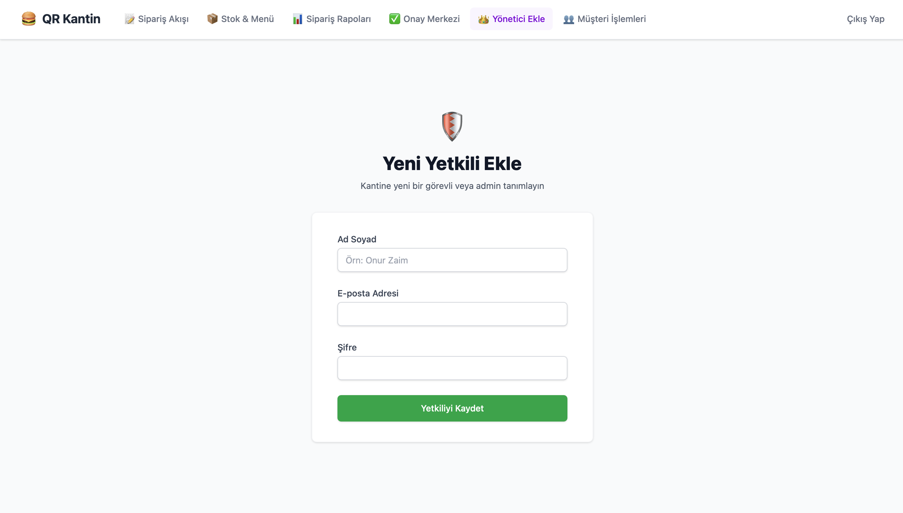
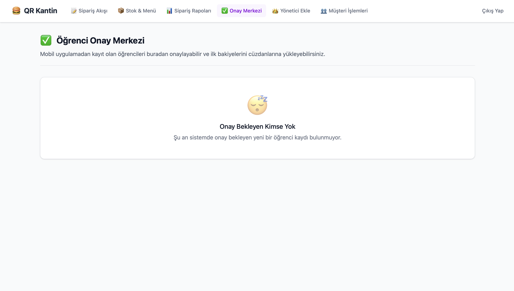

# QR Kantin - Web Yönetim Paneli



Bu proje, **QR Kantin** sisteminin kantin işletmecileri ve yöneticileri tarafından kullanılan web tabanlı yönetim panelidir. Svelte 5 (Runes) mimarisi kullanılarak yüksek performanslı ve reaktif bir kullanıcı deneyimi hedeflenmiştir.

## 🖥️ Sistem Arayüzü ve Ekran Detayları

- Aşağıdaki menüden sistemin tüm arayüz akışını ve ekran detaylarını inceleyebilirsiniz.

<details>
  <summary><b>📸 Tüm Ekran Görüntülerini Görüntülemek İçin Tıklayın</b></summary>
  
  <br>

### 📊 Dashboard ve Canlı Takip


### 📦 Depo ve Menü Yönetimi





### 📈 Raporlar ve Analiz



### 👤 Yönetici Ekleme Paneli



### 👥 Müşteri Onay ve Yönetim




  </details>

## 🚀 Öne Çıkan Özellikler

- **Canlı Sipariş Takibi:** WebSocket entegrasyonu ile gelen siparişlerin anlık görüntülenmesi ve durum yönetimi.
- **Stok & Menü Yönetimi:** Ürün reçeteleri oluşturma, otomatik stok düşümü ve kritik seviye uyarıları.
- **Finansal Raporlama:** Satış verilerinin saatlik ve günlük grafiklerle (Chart.js) analiz edilmesi.
- **Müşteri & Bakiye Yönetimi:** Öğrenci kayıtları, merkezi bakiye yükleme ve harcama geçmişi takibi.
- **Yetkilendirme:** Role-Based Access Control (RBAC) ile güvenli giriş ve işlem yetkilendirmesi.

## 🛠️ Projede Kullanılan Teknolojiler

- **Frontend:** Svelte 5 (Runes API), SvelteKit
- **Styling:** Tailwind CSS
- **Charts:** Chart.js
- **Backend Bağlantısı:** REST API & WebSocket (Go / Echo)

## 📦 Kurulum ve Çalıştırma

Projeyi yerel ortamınızda ayağa kaldırmak için aşağıdaki adımları izleyin:

1.  **Bağımlılıkları Yükleyin:**

    ```bash
    npm install
    ```

2.  **Geliştirme Sunucusunu Başlatın:**

    ```bash
    npm run dev
    ```

3.  **Build (Üretim Çıktısı):**
    ```bash
    npm run build
    ```

## 📜 Lisans ve Telif Hakkı

Bu yazılımın tüm telif hakları **Onur Zaim**'e aittir.

- Kişisel gelişim ve eğitim amaçlı inceleme serbesttir.
- Yazılı izin alınmaksızın herhangi bir ticari faaliyette kullanılamaz, satılamaz veya kopyalanamaz.
- Ticari kullanım talepleri için **zaimonur08@gmail.com** adresi üzerinden iletişime geçilmelidir.

---

© 2026 Onur Zaim. Tüm Hakları Saklıdır.
